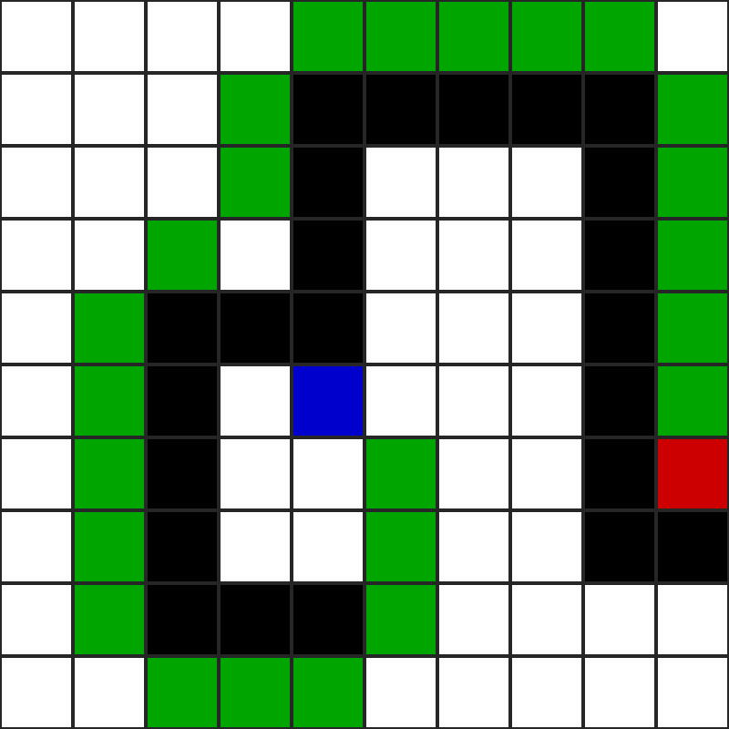

# pathfinder-2d
A 2D Pathfinder using the A* algorithm along with Map visualization. 

## Map Details
--- 
The algorithm finds the path between the Blue node to the Red node. The Black nodes are walls with the White nodes being walkable.

The path is generated and shown as Green Nodes in:-

--- 
## Extra Maps with Path Generation
--- 
- The Path taken changes if target is moved.

- Another case with the target far away from the origin

---
## Options for the Visualisation
--- 
The user can tweak Grid Coloring options for better visualisation of the Pathfinding algo.
For a given map such as:-

- The user can choose to toggle all the nodes which were called to find the path.

- The user can also toggle all the neighbour nodes of these nodes.

## Options for the Pathfinding
--- 
The pathfinding algo can also be tweaked by providing various constraints.
For the previous map:-

- The user can ban Diagonal movement on the Grid leading to a different path

--- 
## Extra Features that can be later added

- Add Other Algos such as:-
  - [ ] BFS
  - [ ] Dijkstra
  - [ ] GBFS
- [ ] Add Path weights
- [ ] Elevated Points
- [ ] 3D Map
